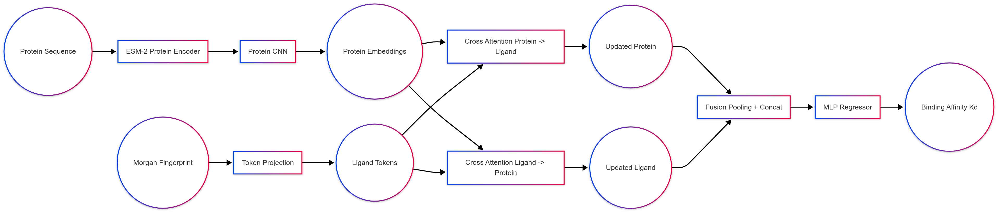
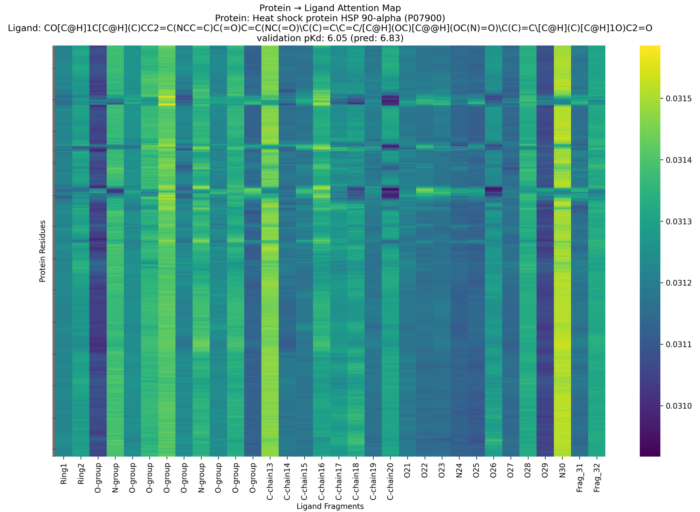

# Structure-Free Prediction and Mechanistic Interpretation of Protein–Ligand Binding Affinity via iBAMs

Accurate prediction of protein–ligand binding affinity is critical for accelerating drug discovery, yet traditional methods are constrained by their dependence on high-resolution structural data and limited mechanistic insight. Here, we introduce DeepBindMini, a novel, lightweight, structure-free deep learning framework that utilizes solely protein sequences and ligand SMILES representations. By integrating a pre-trained protein language model (ESM2) with a convolutional neural network for residue-level feature extraction, and combining these features with chemically rich Morgan fingerprints via a dual cross-attention mechanism, DeepBindMini intrinsically generates Interpretable Binding Attention Maps (iBAMs). These maps provide a high-resolution, bidirectional visualization of key residue–ligand interactions, offering actionable mechanistic insights that guide hypothesis-driven lead optimization in the absence of three-dimensional structures.

### Model Architecture

### iBAM for the HSP90-alpha–Ligand Complex

This heatmap shows cross-attention between HSP90-alpha residues (P07900) and ligand substructures (Morgan fragments). Warmer colors indicate stronger interactions driving predicted binding (pKd = 6.83; actual = 6.05). iBAM provides interpretable insights into protein–ligand focus, aiding rational drug design and lead optimization in structure-based discovery.
